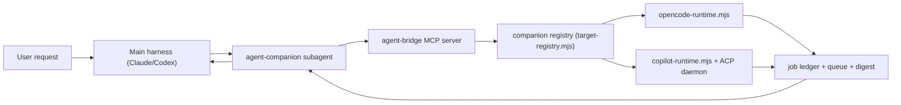

# Agent Companion Architecture

Last updated: 2026-06-23

## Goal

Agent Companion is organized around a harness + companion model:

- **Harnesses outward:** Claude Code and Codex CLI install surfaces today; future
  harnesses should plug in at the host/template/hook/session-routing boundary.
- **MCP middle:** one subagent-only MCP server with generic `agent_*` tools.
- **Companion adapters inward:** OpenCode, Copilot, and future companions behind
  a small runtime boundary.
- **Strength routing next:** future installs can expose strengths to the harness
  while the bridge maps each strength to one configured companion profile.
- **Harness isolation unchanged:** main Claude/main Codex never see the bridge
  tools directly.

## Product Vocabulary

| Product term | Current implementation term | Meaning |
| --- | --- | --- |
| Harness | host | Parent coding-agent surface, currently Claude Code or Codex CLI. |
| Companion | target | Downstream agent runtime, currently OpenCode or GitHub Copilot CLI. |
| Companion profile | not implemented yet | A configured runtime/model instance, such as a Copilot model profile or OpenCode provider/model profile. |
| Strength | not implemented yet | A public capability label such as `reviewer`, `web_researcher`, `planner`, or `fast_executor`. |

The current public flags and schema keep `host` and `target` for compatibility:
`setup.sh --host claude|codex|both` selects harness surfaces, and
`agent_send({ target })` or `default-target` selects today's companion runtime.

## Flow



## Public MCP Surface

The only tools are the generic `agent_*` set:

- `agent_send`
- `agent_wait`
- `agent_status`
- `agent_reply`
- `agent_cancel`

`agent_send` accepts an optional `target` (`opencode` | `copilot`). When
omitted, the target resolves from `AGENT_COMPANION_DEFAULT_TARGET`, then the
`default-target` state file. **There is no silent fallback** — if nothing is
configured and no `target` is passed, `agent_send` returns a
`TARGET_UNCONFIGURED` error pointing at onboarding. There are no legacy
`copilot_*` aliases and no legacy env overrides; the rename to the `agent-*`
identity is complete.

## Companion Matrix

| Companion | Status | Send | Wait | Status | Cancel | Reply | Restart Resume |
| --- | --- | --- | --- | --- | --- | --- | --- |
| OpenCode (cli) | Implemented CLI adapter (default) | yes | yes | yes | yes | no | no |
| OpenCode (server) | Implemented HTTP server adapter | yes | yes | yes | yes | yes | yes |
| Copilot CLI | Implemented ACP adapter | yes | yes | yes | yes | yes | yes with ACP |
| Goose | Planned | no | no | no | no | no | no |
| Aider | Planned | no | no | no | no | no | no |

The OpenCode adapter is selected by `OPENCODE_RUNTIME_ADAPTER` (`cli` default,
`server` opt-in), mirroring how Copilot selects `acp`/`sdk`. Server mode drives a
single detached `opencode serve` and roots each job's session at its own `cwd`
via the `?directory=` query param; terminal detection consumes the directory-
scoped `/event` SSE stream (`session.idle` is the per-turn terminal marker) with a
`/session/status` + transcript level-check as the resume/stream-drop backstop. A
job records the adapter it started with (`opencodeAdapter`), and per-job
`reply_available` / `resume_available` flags on the status response report what
that specific job can do — independent of the current env.

## Current Routing Contract

Routing is deliberately one-to-one in the MVP:

1. A harness asks the `agent-companion` subagent to send work.
2. The bridge resolves exactly one companion target from the explicit `target`
   field or the configured default target.
3. The resolved adapter owns that job until terminal status.

This contract keeps the public surface small while the project proves the
harness isolation, digest, wait, cancel, and onboarding mechanics.

## Future Strength Router

The next routing shape is one-to-many. Users should be able to configure
multiple companion profiles, including multiple model profiles from the same
runtime, then assign strengths to those profiles. Harnesses should see only the
strength names and should not need to know whether a strength is backed by
Copilot, OpenCode, another companion, or a specific model behind one of them.

Illustrative future profile shape:

```jsonc
{
  "profiles": [
    {
      "id": "copilot_claude_sonnet_4_6",
      "companion": "copilot",
      "model": "claude-sonnet-4.6",
      "strengths": ["web_researcher"]
    },
    {
      "id": "copilot_gpt_5_4",
      "companion": "copilot",
      "model": "gpt-5.4",
      "strengths": ["reviewer"]
    },
    {
      "id": "opencode_provider_model",
      "companion": "opencode",
      "model": "provider/model",
      "strengths": ["fast_executor"]
    }
  ]
}
```

This is roadmap only. The current bridge accepts `target=opencode|copilot`,
not profile ids or strengths. A future router should be capability-driven and
should avoid assuming every companion supports reply, resume, parallelism,
streaming, or model selection.

## Companion Adapter Contract

Current MVP adapters are not yet formal classes. The stable contract is visible through job fields and handlers:

- A companion send creates a job with `target`, `jobId`, `task`, `cwd`,
  `thread`, `mode`, `template`, `parallelStrategy`, `status`, and `startedAt`.
- Terminal adapters call `retainTerminalJob` with `status`, `summary`, `error`, `detail`, `durationMs`, and `terminalAt`.
- `summary.message` is the user-visible terminal message. `summary.toolCalls` is optional.
- Adapters should write or refresh a digest before terminal notification when they have transcript/output material.

## State

State lives under the host-routed companion home `~/.{claude,codex}/agent-companion/`:

- `default-model`: Copilot model config.
- `default-target`: configured default target (written by onboarding).
- `threads/`: logical companion thread names.
- `threads/by-host-session/`: Codex host-session to companion-thread mapping.
- `jobs/`: persisted in-flight/recent jobs for restart recovery. OpenCode
  server jobs persist their `ses_` session id (under the target-neutral
  `companionSessionId` key) and the server `baseUrl` so a respawned bridge can
  resume them.
- `runtime/`: logs, queue, prompt streams, and digests.
- `runtime/opencode-servers.json`: registry of the shared detached
  `opencode serve` process so a respawned bridge reattaches instead of
  re-spawning.

## Naming

The product identity is uniformly `agent-*`, with no backward-compatibility shims:

- MCP server: `agent-bridge`.
- Digest URIs: `agent-digest://<jobId>`.
- Env prefix: `AGENT_COMPANION_*` (and `AGENT_RUNTIME_DIR` / `AGENT_BRIDGE_LOG_FILE` / `AGENT_DIGEST_DIR` / etc. for runtime paths).
- Repo / package / plugin / subagent / template names: `agent-companion`.

The Copilot *companion adapter* keeps its own `copilot-*` identifiers
(`copilot-runtime.mjs`, `copilot-acp-daemon`, `COPILOT_BIN`,
`COPILOT_RUNTIME_ADAPTER`, the `~/.copilot/agents/reviewer.agent.md` reviewer)
— those name the Copilot companion, not the product.
